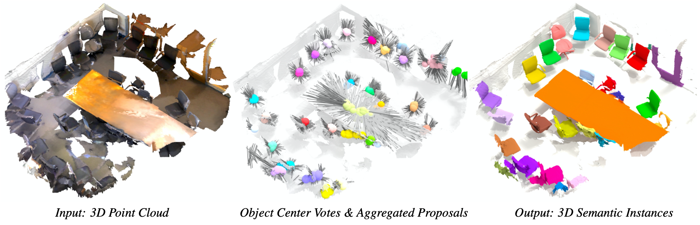

# 3D-MPA: Multi Proposal Aggregation for 3D Semantic Instance Segmentation
IEEE Conference on Computer Vision and Pattern Recognition (CVPR), 2020.



## Introduction

This repository is code release for our CVPR 2020 paper ([ArXiv Paper](https://arxiv.org/pdf/2003.13867.pdf))

While we prepare the code release, have a look at the interactive demo on our project page and the teaser video:
- [Project Page](https://francisengelmann.github.io/3D-MPA/)
- [YouTube Video](https://www.youtube.com/watch?v=ifL8yTbRFDk&feature=emb_logo)

## Predictions on ScanNet

We provide the predictions of 3D-MPA over all three ScanNet splits: [3D-MPA ScanNet Predictions](https://omnomnom.vision.rwth-aachen.de/data/3d_mpa/scannet_predictions_3d_mpa.zip)  
The format of the predictions is the same as used for evaluation on the ScanNet online benchmark, as described [here](http://kaldir.vc.in.tum.de/scannet_benchmark/documentation#format-instance3d).

## Citation

If you find our work useful in your research, please consider citing:
```
@inproceedings{Engelmann20CVPR,
  title = {{3D-MPA: Multi Proposal Aggregation for 3D Semantic Instance Segmentation}},
  author = {Engelmann, Francis and Bokeloh, Martin and Fathi, Alireza and Leibe, Bastian and Nie{\ss}ner, Matthias},
  booktitle = {{IEEE Conference on Computer Vision and Pattern Recognition (CVPR)}},
  year = {2020}
}
```
